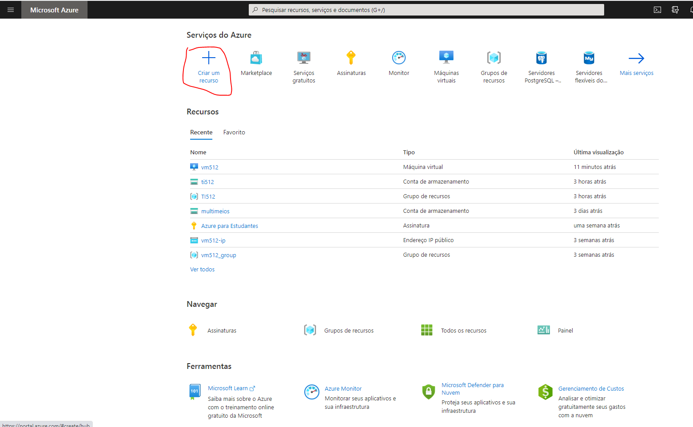
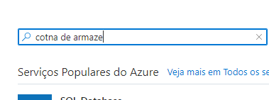
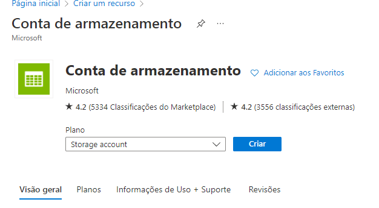
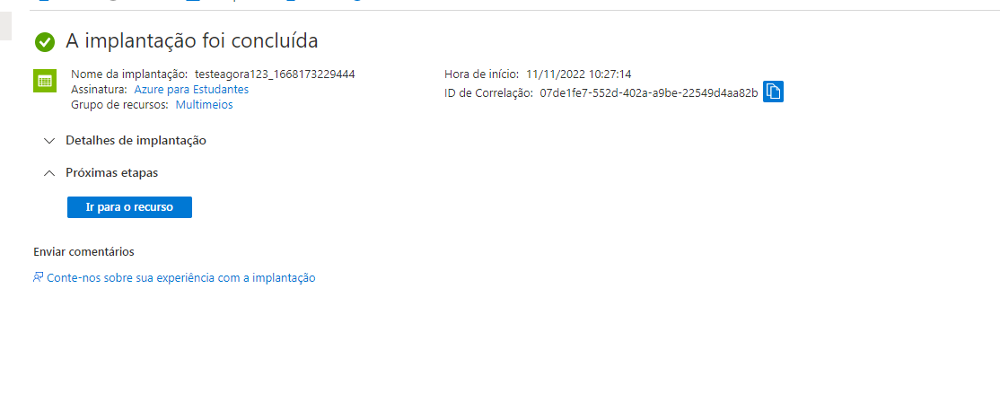
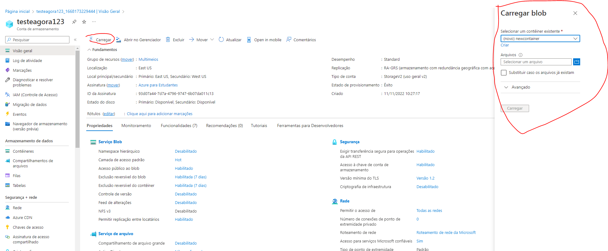

# AZ-900-CREATE-BLOB-SPACE

Acesse https://portal.azure.com/#home

Clique em criar recurso

Busque por Conta de armazenamento e clique em criar

Clique em ir para recurso

Clique em carregar para fazer uploads de arquivos e criar (containers ou espaços especifícos para armazenamento)

# Parabéns você criou seu espaço de armazenamento com sucesso!
